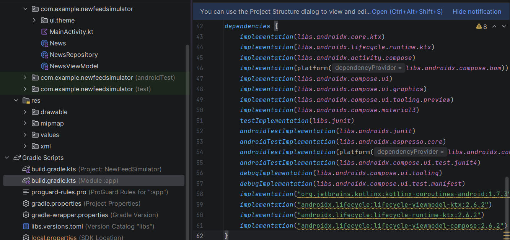
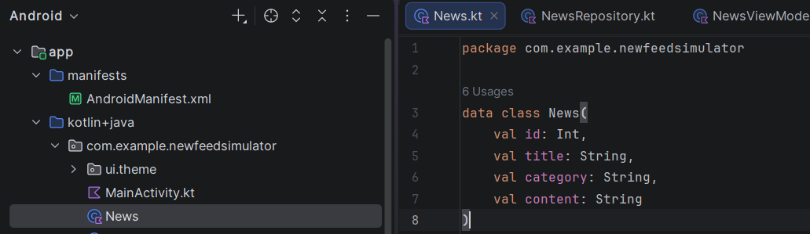
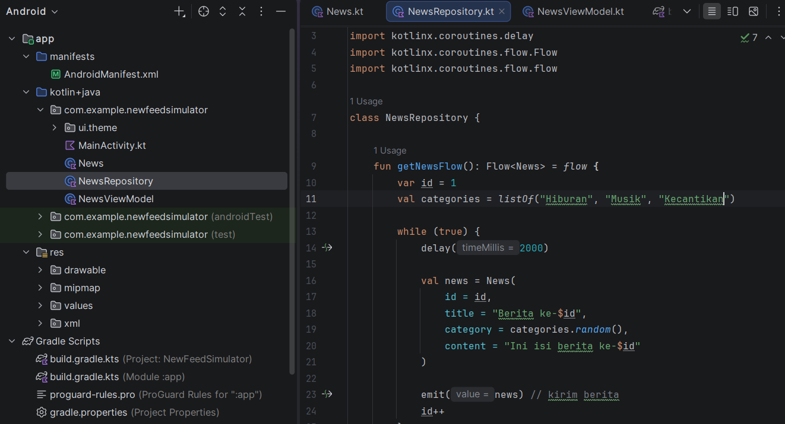
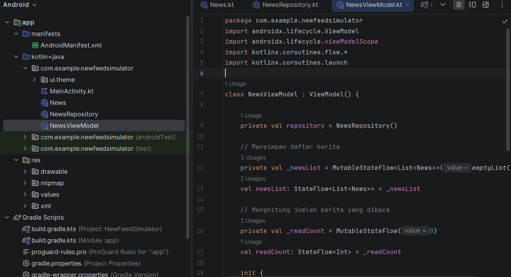
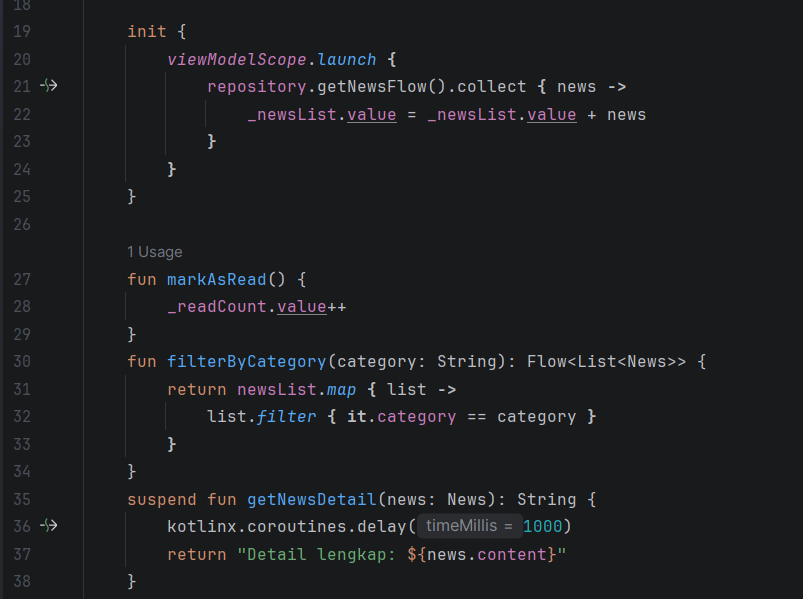
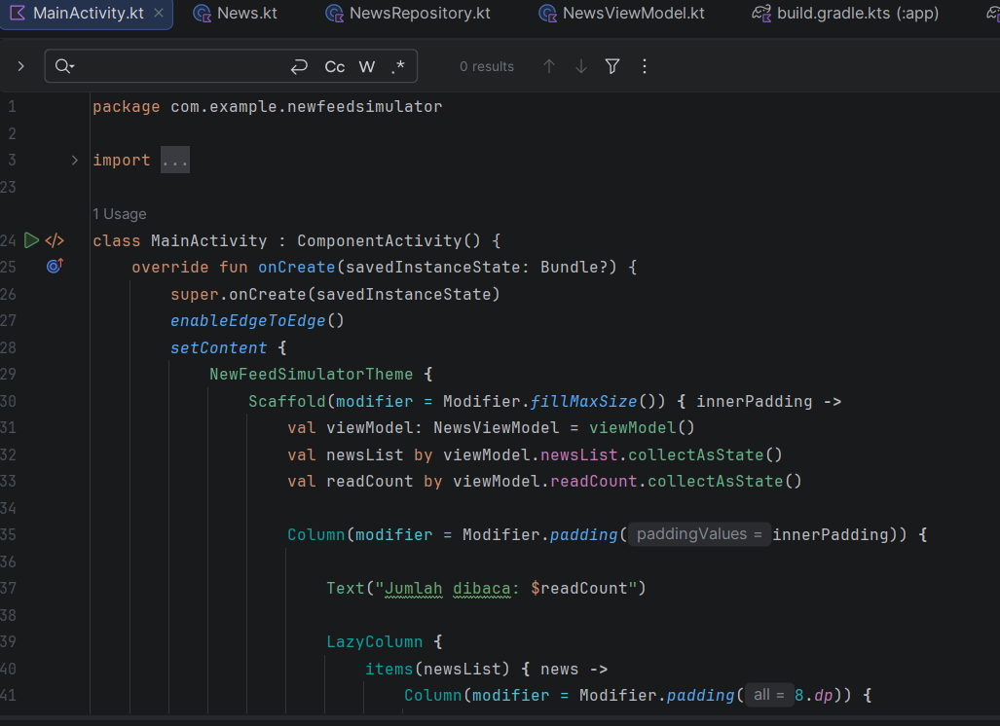
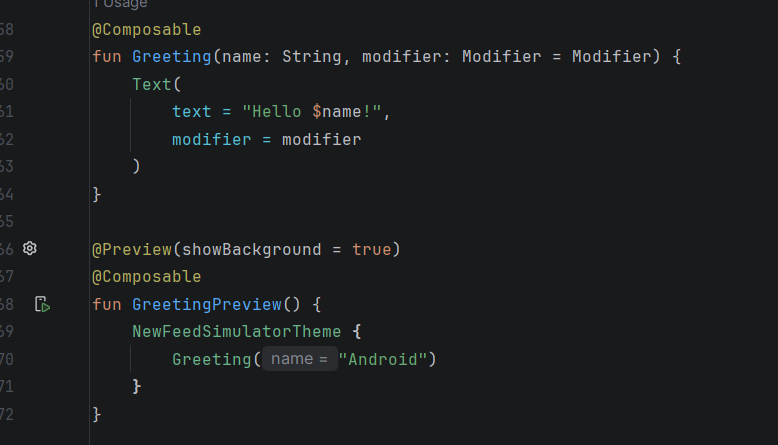

Nama  : Arta Eka Yuly Rajagukguk
NIM  : 123140209
Matkul  : Pengembangan Aplikasi Mobile

Deskripsi:
Aplikasi Android sederhana yang mensimulasikan news feed realtime menggunakan Kotlin. Berita muncul otomatis setiap 2 detik dan pengguna dapat menandai berita yang telah dibaca.

Fitur:
Berita muncul otomatis setiap 2 detik (Flow)
Menampilkan kategori berita (Hiburan, Musik, Kecantikan)
Transformasi data sebelum ditampilkan
Menghitung jumlah berita yang dibaca (StateFlow)
Proses asynchronous menggunakan Coroutines

Screenshot:
1. Mengedit build.gradle.kts (Module: app) untuk menambahkan dependency Compose, ViewModel, dan Coroutines.
   Melakukan Gradle Sync agar semua library terpasang
   

2. Membuat class News.kt sebagai model data berita

3. Membuat NewsRepository.kt untuk menghasilkan berita otomatis menggunakan Flow

4. Membuat NewsViewModel.kt untuk mengelola data dan status aplikasi

5. Menambahkan logic Flow, StateFlow, dan Coroutine pada ViewModel

6. Mendesain tampilan aplikasi di MainActivity.kt menggunakan Jetpack Compose

7. Menjalankan aplikasi di emulator untuk memastikan fitur berjalan baik
   

